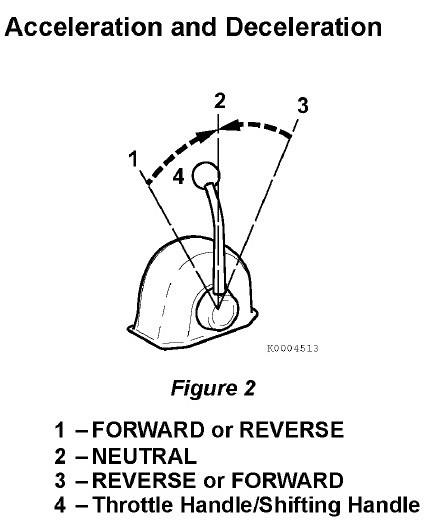
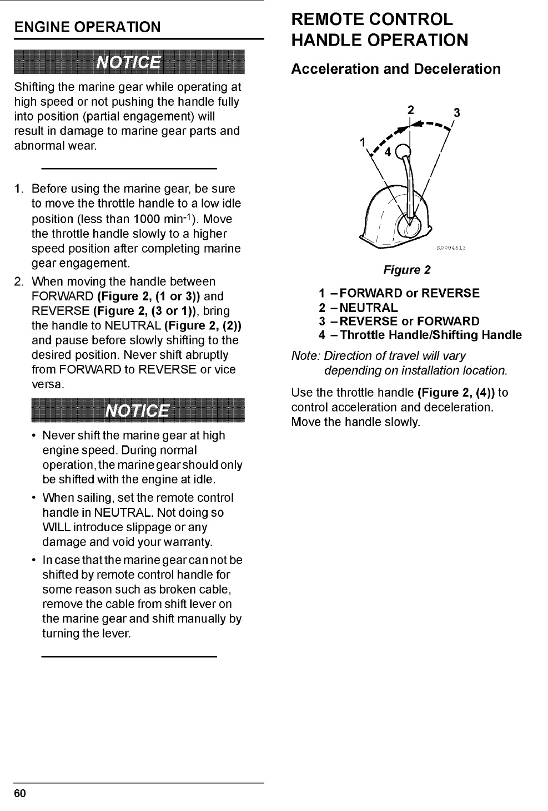

# Engine Operation

> **NOTICE**
>
> Shifting the marine gear while operating at high speed or not pushing the handle fully into position (partial engagement) will result in damage to marine gear parts and abnormal wear.

---

1. Before using the marine gear, be sure to move the throttle handle to a low idle position (less than 1000 RPM). Move the throttle handle slowly to a higher speed position after completing marine gear engagement.

2. When moving the handle between FORWARD (Figure 2, (1 or 3)) and REVERSE (Figure 2, (3 or 1)), bring the handle to NEUTRAL (Figure 2, (2)) and pause before slowly shifting to the desired position. Never shift abruptly from FORWARD to REVERSE or vice versa.

> **NOTICE**
>
> - Never shift the marine gear at high engine speed. During normal operation, the marine gear should only be shifted with the engine at idle.
> - When sailing, set the remote control handle in NEUTRAL. Not doing so WILL introduce slippage or any damage and void your warranty.
> - In case that the marine gear cannot be shifted by remote control handle for some reason such as a broken cable, remove the cable from the shift lever on the marine gear and shift manually by turning the lever.

---
**From the engine manual**

