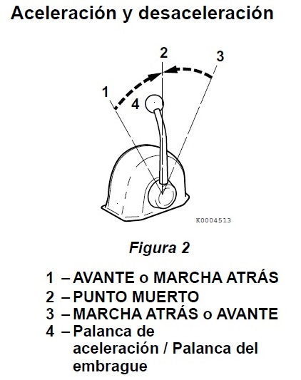
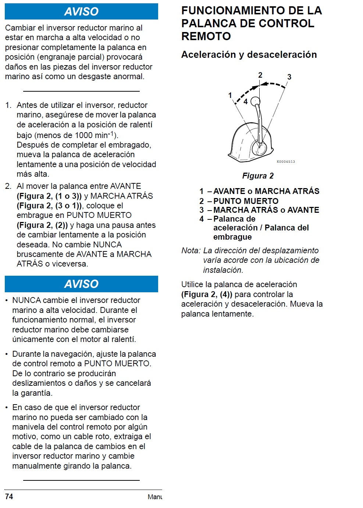

# Engine Operation

> **AVISO**
> Cambiar el inversor reductor marino al estar en marcha a alta velocidad o no presionar completamente la palanca en posición (engranaje parcial) provocará daños en las piezas del inversor reductor marino así como un desgaste anormal.
---

1. Antes de utilizar el inversor, reductor marino, asegúrese de mover la palanca de aceleración a la posición de ralentí bajo (menos de 1000 RPM). Después de completar el embragado, mueva la palanca de aceleración lentamente a una posición de velocidad más alta.

2. Al mover la palanca entre AVANTE (Figura 2, (1 o 3)) y MARCHA ATRÁS (Figura 2, (3 o 1)), coloque el embrague en PUNTO MUERTO (Figura 2, (2)) y haga una pausa antes de cambiar lentamente a la posición deseada. No cambie NUNCA bruscamente de AVANTE a MARCHA ATRÁS o viceversa.

> **AVISO**
>
> - NUNCA cambie el inversor reductor marino a alta velocidad. Durante el funcionamiento normal, el inversor reductor marino debe cambiarse únicamente con el motor al ralentí.
> - Durante la navegación, ajuste la palanca de control remoto a PUNTO MUERTO. De lo contrario se producirán deslizamientos o daños y se cancelará la garantía.
> - En caso de que el inversor reductor marino no pueda ser cambiado con la manivela del control remoto por algún motivo, como un cable roto, extraiga el cable de la palanca de cambios en el inversor reductor marino y cambie manualmente girando la palanca.

---

**Del manual del motor**

